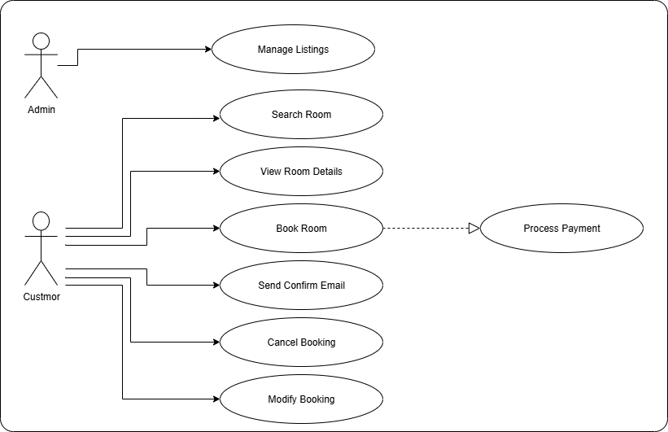

# Requirement Analysis in Software Development.

This repo is created as part of a project to document and explain the process of Requirement Analysis in Software Development. It covers definitions, importance, key activities, types of requirements, use case diagrams, and acceptance criteria.

## What is Requirement Analysis?

Requirement Analysis is the process of identifying, analyzing, and documenting the needs and expectations of stakeholders for a software system. It acts as the foundation for the entire Software Development Lifecycle (SDLC). 
It ensures that the development team fully understands what the stakeholders want, reduces misunderstandings, and guides design, coding, and testing activities.

## Why is Requirement Analysis Important?

- **Clarity and Understanding:** It helps in understanding what the stakeholders expect from the software, reducing ambiguity.
- **Scope Definition:** Clearly defines the scope of the project, which helps in preventing scope creep.
- **Basis for Design and Development:** Provides a solid foundation for designing and developing the system.
- **Cost and Time Estimation:** Facilitates accurate estimation of project cost, resources, and time.
- **Quality Assurance:** Ensures that the final product meets the specified requirements, leading to higher customer satisfaction.

## Key Activities in Requirement Analysis

- **Requirement Gathering:** Collecting needs from stakeholders through interviews, surveys, and observations.  
- **Requirement Elicitation:** Engaging stakeholders to uncover hidden needs, constraints, and assumptions.  
- **Requirement Documentation:** Writing clear and structured requirement specifications.  
- **Requirement Analysis and Modeling:** Studying requirements, checking feasibility, and representing them using diagrams/models.  
- **Requirement Validation:** Ensuring requirements are correct, complete, and aligned with business goals.  

## Types of Requirements

### Functional Requirements
These define what the system should do.  
Example (Booking Management System):  
- Users can search for available rooms.  
- Users can make, cancel, or modify bookings.  
- The system sends confirmation emails after booking.  

### Non-Functional Requirements
These define system qualities and constraints.  
Example (Booking Management System):  
- The system should handle up to 1000 concurrent users.  
- Response time for booking confirmation should be less than 2 seconds.  
- The system must be available 99.9% of the time.  

## Use Case Diagrams

Use Case Diagrams represent the interactions between users (actors) and the system. They help visualize system functionality and clarify requirements.  

## Acceptance Criteria

Acceptance Criteria are conditions that a software feature must meet to be accepted by stakeholders. They ensure requirements are testable and measurable.  

**Example (Checkout Feature in Booking System):**  
- User can view booking details before payment.  
- System must support multiple payment methods (Credit Card, PayPal).  
- Payment confirmation should be sent via email within 1 minute.  
- If payment fails, user is redirected to retry or choose another method.

  

